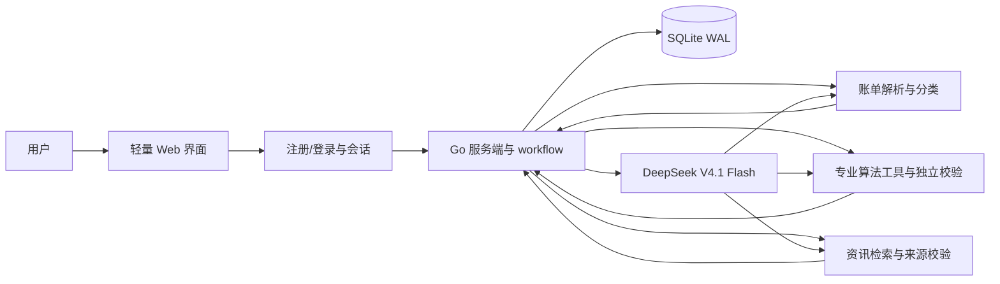

# 工行杯个人财务规划 WebApp — WORKPLAN

状态：按 2026-10-07 批准的自主方案 Agent 与分类开销对话流程实施；持续验收中

界面流程修订（2026-10-07）：注册/登录后按「自然对话并确认 Income / Outcome / Feature，可在对话中记录分类月开销 → 可选核对分类开销、CSV 或跳过 → 自主 Agent 方案」单线程推进；复盘和答疑仅作为方案后的可选分支。画像助手不能提供分配建议。`/` 根据账号进度跳转。跳过账本时仍采用对话中记录的分类开销和月总支出；连粗略估计也缺失时只给不含具体分配金额的临时摘要。

## 1. 产品定位与 MVP 边界

面向中国大陆、以人民币管理月度预算的个人用户，也包括以生活费为主要收入的学生。演示目标是让**多名用户同时在线、各自登录**，并在各自的独立空间中完成「自然对话 → 可选账本 → 获得可解释的月度预算和资金分配方案 → 可选复盘或答疑」的闭环。

本计划将“预期年化大于 3%”作为长期财富增值部分的**规划目标**，不是产品收益承诺，也不把整体家庭资产、风险预备金或任意一个月的收益都宣称能达到该值。若用户不能承受亏损、现金流不足、存在高息债务或预备金不足，系统应明确提示目标当前不适用，先处理更优先的问题。

MVP 提供预算与资产类别层面的建议，不提供具体金融产品的买卖、代客交易、账户直连、自动扣款或收益保证。这一范围由产品目标决定；方案仍需显示风险、假设和计算依据。

## 2. 用户流程与页面

| 页面/步骤 | 用户可做的事 | 系统输出与关键状态 |
| --- | --- | --- |
| 注册/登录 | 创建个人账号、登录 | 自动回到账号当前步骤；不同用户互不可见 |
| 自然对话与三项摘要 | Agent 在多轮对话中自主决定追问；只围绕 Income（月度可用收入）、Outcome（月度支出）、Feature（个人特点）回显摘要 | 用户确认摘要后进入可选开销；风险等细节由 Feature 承载，未知时按保守档 |
| 可选开销 | 默认按住房、餐饮、医疗等填写分类月开销；可直接跳过，CSV 放在小入口；已有逐笔交易仍可编辑 | 记录已填写、已导入或已跳过状态；三条路径均可进入方案 |
| 方案页 | 查看月度收支分配、预备金缺口、三类资金安排，调整约束后重新生成 | 每笔预算的计算依据、可用余额、风险解释、来源与更新时间；展示方案版本 |
| 解释对话 | 询问“为什么这样分配”“如果收入下降怎么办”，提出调整意见 | Agent 解释已有计算与来源；变更须重新经过规则校验并形成新版本 |
| 本月执行 | 在可视化账本补录、编辑交易或再导入当月 CSV | 类别预算剩余额、超支提醒、计划储蓄与实际储蓄 |
| 月末复盘 | 对比计划与实际，确认下月调整 | 收支变化、净结余、预备金进度、目标偏差、调整建议；区分“已存下的钱”和“投资收益” |

演示路径：新账号先用自然语言描述收入、支出与特点，或直接编辑三项摘要；开销页可填分类金额、导入 CSV、载入**仅属于该账号**的模拟账单，或直接跳过。演示时准备两个独立账号并发操作，验证数据、对话和方案不会串号。

## 3. 数据来源与处理

### 3.1 账单

MVP 默认提供分类月开销的快速填写；账本整体可跳过。CSV 保留独立的小入口和导入预览；旧有逐笔记录、编辑与筛选能力放在次级详情中。不做银行或支付平台账户抓取。分类估计与逐笔账单分别存储，避免把粗估伪装成真实交易。

CSV 提供通用模板和字段映射器，兼容常见导出列名，但以实际用户文件预览确认的列映射为准。导入前展示解析结果；服务端做类型校验、金额符号统一、去重、异常值标记。无法识别的记录进入“待确认”，不悄悄计入预算。CSV 与手填记录进入同一标准化交易模型，均可在账本页面修正分类；导入批次和记录绑定当前账号，重复检测限定在该账号内。

### 3.2 新闻与宏观信息

服务端用 [GDELT DOC 2.0 API](https://blog.gdeltproject.org/gdelt-doc-2-0-api-debuts/)检索近期经济与金融新闻标题、日期和原文链接；对与方案相关的宏观事实，优先展示[中国人民银行](https://www.pbc.gov.cn/)及[国家统计局数据发布](https://www.stats.gov.cn/sj/zxfb/)等原始出处。新闻只提供环境背景和风险提示，不直接决定个人风险等级或生成“必涨”判断。每条进入方案的材料保存来源、发布时间、抓取时间、关联结论；过期、无出处或取回失败时隐藏相应论据并标明“外部资讯暂不可用”。不依赖未经授权的付费行情接口。

### 3.3 DeepSeek

官方文档确认 V4.1 Flash 的 API 模型 ID 为 `deepseek-flash`，接口基址为 `https://api.deepseek.com`，支持结构化输出和工具调用：[接入文档](https://api-docs.deepseek.com/guides/codex)、[Responses API](https://api-docs.deepseek.com/api/create-response/)。仓库当前的密钥位于 `.env/deepseek_api.key`（这是目录下的密钥文件，不是普通 dotenv 格式的 `.env` 文件）。实现时由服务端读取该文件，或读取部署环境变量 `DEEPSEEK_API_KEY`；不向浏览器下发。首个开发步骤要将 `.env/`、`.env.local` 加入 `.gitignore`，并检查 Git 跟踪状态。模型请求使用汇总数据和必要字段，减少令牌开销。

## 4. 方案生成规则

**方案由 Agent 在受控 workflow 中生成**：Agent 决定是否追问、调用哪些专业计算工具、如何解释权衡与给出候选方案；工具返回可复算的数字、约束和出处。Agent 不能凭文字绕过现金流、风险和总额校验。这样既保留个性化推理，也让每个金额都有明确的算法来源。

### 4.1 检索到的专业方法及采用方式

| 方法 | 可复现计算/判断 | 在本产品中的用法与边界 |
| --- | --- | --- |
| [CFPB 的 50/30/20 预算规则](https://www.consumerfinance.gov/consumer-tools/educator-tools/youth-financial-education/teach/activities/analyzing-budgets/) | 以**税后月收入**为分母，必要支出、可选支出、储蓄目标的参考比例为 50%、30%、20% | 作为对照基线，而非强制比例；实际必要支出和债务还款优先，超出基线时展示偏差并要求 Agent 解释 |
| [FINRA 的应急资金方法](https://syndication.finra.org/content/start-your-financial-road-trip-emergency-fund)、[CFPB 的因人而异原则](https://www.consumerfinance.gov/an-essential-guide-to-building-an-emergency-fund/) | 3–6 个月是一般参考，具体目标取决于本人需承担的生活和意外开支 | Agent 根据家庭支持、收入波动、现有流动资金和目标期限自定短期缓冲或应急储备；不对学生自动套 3/6 个月。服务端计算目标缺口并限制本月补足额 |
| [FINRA 的风险能力、期限与流动性框架](https://www.finra.org/investors/insights/know-your-risk-tolerance) | 分别评估承受损失的**能力**、主观**意愿**、资金使用**期限**和流动性需求 | Agent 自主决定配置比例，不使用低/中/高风险的固定增长类比例上限；服务端以用户明确陈述的可承受亏损、期限和披露的压力情景独立校验。未知亏损意愿时不安排波动类资产 |
| [SEC 的资产配置与再平衡原则](https://www.investor.gov/additional-resources/general-resources/publications-research/info-sheets/beginners-guide-asset) | 资产类别随目标期限和风险承受能力变化；持续投入可优先补足低配类别 | 仅给现金/低波动/增长类的候选比例与情景；月末复盘先比较目标与实际偏差，再建议调整新增投入，不按新闻涨跌追逐热点 |

曾核对[Markowitz 均值—方差组合模型原论文](https://onlinelibrary.wiley.com/doi/abs/10.1111/j.1540-6261.1952.tb01525.x)。它需要可信的资产预期收益、波动率和协方差估计；本 MVP 不提供具体可投资产品和可靠行情，故不把它直接用于计算“最优组合”，以免产生虚假的精确度。未来若取得可验证行情与产品数据，可把它作为独立实验模块评估。

### 4.2 自主方案 Agent 与独立校验

1. **核实输入**：手填或对话中的分类月开销、CSV 账单和 Outcome 粗估进入同一现金流摘要。仅填部分类别时，月总支出与分类合计之间的差额标作未分类必要开支；分类合计较高时采用较高值并提示。Outcome 完全未知且无分类开销时，只保存不含分配金额的临时摘要。
2. **确定可分配结余**：Go 服务端核算 `max(0, 月收入 − 已知必要开支 − 已发生可选开支 − 最低还款)`。Agent 不得降低已发生支出或最低还款。50/30/20 仅作为对照，不能直接生成配置比例。
3. **自主提案**：方案 Agent 使用 Eino ADK `ChatModelAgent` 的工具循环，按需读取当前账号财务事实和专业参考，并自主提出结余在流动缓冲、额外还款、近期目标储蓄、保守储蓄、稳健与增长类别中的百分比，合计为 100%。没有固定的三档增长类比例上限。学生的家庭支持和本人责任作为决策事实；支持情况不明且足以影响结论时，Agent 将问题交回画像对话。
4. **结构化校验与修订**：Agent 调用 `evaluate_candidate` 试算，再用 `submit_plan` 提交。工具拒绝超额、负金额、比例不守恒、缓冲补足超过缺口、无债务却额外还款、短期资金进入增长类等候选，并返回原因供 Agent 修改。服务端将比例转成整数分金额，不展示模型自由文本中的金额。
5. **风险核查**：压力测试明确假设稳健类别下跌 8%、增长类别下跌 35%，计算提案在该情景下的亏损占可配置资产比例，并与用户明确说出的可承受亏损比较；未知时按零处理。这两个跌幅是产品用于校验的演示假设，**不是市场预测或最大可能损失**，也不是配置比例上限。期限不足时拒绝将近期要用的钱投入波动类别。
6. **目标和解释**：2%／3.5%／6% 的类别收益及 0.5% 费用仅作假设情景，核对长期“>3%”目标，不作收益承诺。Agent 给出不含金额的个人化理由；服务端插入已核实金额与计算步骤，版本化保存。新闻只提供有出处的背景，不改变个人风险判断。
7. **故障与旧版处理**：模型不可用或候选反复未通过校验时，保留已核实收支并明确告知未生成个性化方案；不以旧固定比例方案代替。此前保存的固定规则版本在页面标明需重新生成，不当作当前方案。用户调整可选开支后重新运行 Agent 和校验。

## 5. Agent 与后端工作流

- **画像 Agent（Eino ChatModelAgent + DeepSeek 适配器）**：模型在多轮对话中自主决定追问，调用 `record_profile_facts` 和 `record_monthly_expenses` 记录明确陈述的事实与分类月开销。三项核心概念齐备时由服务端限定回复为摘要核对及下一步引导；画像助手不输出方案。模型不可用时仍可直接编辑三项摘要和分类开销。
- **方案 Agent（Eino ChatModelAgent）**：模型按需调用财务事实、非约束参考、候选试算、提交方案与关键事实追问工具，自主决定比例。服务端复算金额与压力情景，并检查风险和资金守恒；最终展示金额由服务端生成，避免模型自由文本改写数字。单次生成限制轮次、超时、令牌和并发，以适应 1 核 VPS。
- **问答与反馈**：优先从当前用户的方案版本、账单汇总和来源回答。Agent 的调整提议以显式参数提交给规则引擎，用户确认后保存新方案。月末反馈使用实际交易重新计算，不由模型编造“攒了多少钱”。每次工具调用都携带服务端已验证的用户上下文，不能由模型选择或改写用户 ID。
- **模型故障降级**：若 API 不可用，仍可核实画像、分类开销、CSV 和收支摘要；界面明确告知方案 Agent 尚未生成个性化分配。已有版本与复盘仍可查看。

## 6. 技术架构与数据模型

目标部署环境固定为**日本 VPS：1 vCPU / 1 GiB RAM / 5 GiB 存储**。建议用 **Go 单进程服务**承载 HTTP、页面模板、CSV 解析、workflow、DeepSeek 调用和定时资讯缓存；静态 CSS/少量 JavaScript 与图表资源打包进可执行文件，页面采用服务端渲染并用少量渐进增强交互实现可视化账本。VPS 不运行 Node.js 构建器、Next.js 服务、PostgreSQL、Redis、向量数据库或本地大模型。开发/构建在本地或 CI 完成，仅把产物部署到 VPS。

数据存储改为 **SQLite WAL**，单机短事务和索引支持 MVP 的少量并发账号。SQLite 官方说明 WAL 可让读写并行，但仍只有一个写入者，因此对方案生成采用短事务、写入排队/忙等待与有限并发，避免持有数据库锁等待模型或新闻接口：[SQLite WAL 文档](https://www.sqlite.org/wal.html)。选用已修复官方 WAL 缺陷的受维护 SQLite 版本，部署前验证驱动内核版本。HTTPS 可由轻量反向代理提供；整个服务按单机单实例设计，未来流量增长再迁移到独立数据库。

资源约束纳入实现和验收：上传 CSV 采用流式解析并限制大小与行数，原文件默认不落盘；模型和新闻请求设置超时、并发上限与用户级频率限制；公共新闻短期缓存，个人化结果不跨用户缓存。日志轮转、SQLite 检查点和离机备份控制 5 GiB 磁盘使用；备份使用 SQLite 一致性备份方式，不能直接复制正在写入的数据库文件。以双账号并发演示和资源监测检验 1 GiB 内存与 5 GiB 磁盘约束，不预先承诺未经压测的用户容量。账号和交易额度按压测结果设置，达到容量上限时拒绝新增上传并给出可理解的提示。

账号采用注册/登录和安全会话；具体实现可使用成熟的认证库、服务端密码哈希与受保护的会话 Cookie。注册、登录设置基本的请求频率限制，退出登录使会话失效。不在客户端保存密码或 DeepSeek 密钥。每个请求先验证会话，再根据当前会话确定用户身份；不能信任浏览器传来的 `userId`。

主要实体：`User`（账号）、`Session`（登录会话）、`Profile`（画像与确认状态）、`Transaction`（标准化交易与导入批次，注明 CSV/手填来源）、`PlanVersion`（参数、算法版本、金额、解释和来源）、`WorkflowRun`（工具调用与校验摘要）、`MonthlyReview`（计划与实际快照）、`SourceRecord`（新闻/宏观出处与时间）、`Conversation`（必要的对话上下文）。所有个人实体有明确的 `userId` 归属；读取、修改、删除时均按当前会话的 `userId` 过滤并复核归属。公共新闻可共享缓存，但个人化摘要与对话不得共用缓存键。金额以“分”为整数存储，日期和时区显式处理；账单原文件默认解析后删除，仅保留用户确认的标准化交易。用户可删除自己的全部账单、画像、方案和对话数据。

API 以业务动作划分：注册/登录/退出、上传/预览与确认账单、可视化交易增删改、画像问答与确认、生成/调整方案、当月交易补录、生成复盘、来源检索、清空我的数据。每个写操作有输入校验和错误码；上传限制文件类型与大小，外部资讯抓取有超时和缓存。方案版本更新采用事务与版本号检查，避免同一账号多标签页同时修改造成覆盖。服务端诊断日志不写入密钥或原始账单。

## 7. 页面表现与解释方式

视觉重点是让评委在短时间内看懂三件事：**钱从哪里来、分到哪里去、执行后剩多少**。登录后直接进入当前步骤；顶部仅显示进度和账号。画像页先自然对话、再核对三项摘要；开销页将“跳过”放在首屏，默认填写分类月开销，CSV 在小入口中；方案页按现金流、预备金、配置和解释纵向展开，复盘与答疑由方案页可选进入。所有新闻引用可点击原文并显示日期。手机和桌面宽度均可使用，流程操作带轻量动画并尊重减少动态效果设置。

关键空态/异常态：账单不足一个月、没有收入记录、收支为负、重复交易、风险答案冲突、资讯过期、模型超时、没有投资空间。每一种状态都给用户下一步操作，不生成看似精确但无依据的比例。

## 8. 开发顺序与验收

| 阶段 | 交付物 | 验收标准 |
| --- | --- | --- |
| 0. 轻量基础、账号与密钥保护 | Go 单进程、SQLite WAL、注册/登录、会话、环境配置、Git 忽略规则、每账号模拟数据 | 两个账号可同时登录；密钥不进入客户端包和版本库；VPS 上不运行数据库/Node 独立服务 |
| 1. 三概念画像与可选开销 | Eino 自主对话、Income / Outcome / Feature 摘要确认、对话写入分类月开销、跳过、CSV 映射/校验 | 学生生活费与工资等场景均可完成；画像助手不越界出方案；已知分类可预填且跳过不丢失；两账号记录隔离 |
| 2. 自主方案 Agent 与独立校验 | Eino 工具循环、自主候选比例、试算反馈、结构化提交、金额及压力情景校验 | 学生、独立负担生活费者、负结余及不同亏损意愿产生有依据的分支；不存在固定配置比例；Agent 输出不得越过校验 |
| 3. 资讯与 Agent | GDELT 检索、来源卡片、DeepSeek 交互与方案解释 | 有出处才引用；新闻失败不影响方案判断；模型失败时仍可查看核实收支，但不生成新分配 |
| 4. 复盘与多用户演示 | 月内补录、月末对比、清空数据、双账号演示脚本 | 两名用户同时从空档案到复盘完整走通，数据与对话隔离；CSV 上传和页面手填均可用 |

必要验证：预算、预备金和风险算法的固定输入/输出样例及边界测试（零收入、负结余、债务高、低风险、短期限）；CSV 与可视化手填的金额、日期、重复及编辑测试；模型输出结构和工具限制测试；双账号完整演示流程；移动端布局和数据删除检查。针对每个个人数据 API 做跨账号访问测试：用户 A 不得读取、修改、删除用户 B 的账单、画像、方案、复盘或对话；还要验证登录失效、同时更新方案的版本冲突，以及样例数据只进入本账号。在目标规格 VPS 上记录并发演示时的峰值内存、CPU、磁盘用量与响应情况，完成后记录启动命令、备份/恢复步骤和已知容量限制。

## 9. 已批准的产品决定与剩余参数

依据本轮审批，以下方向已确定：

1. MVP 面向**中国大陆个人用户、人民币月度预算**；允许每账号载入模拟账单。
2. 建议停留在**资产类别与预算分配**层面，不展示具体产品名称或购买入口。
3. 2026-10-07 新决定覆盖此前默认值：**取消低/中/高风险 0%/20%/40% 增长类上限**，也不再对所有用户强制应用 3/6 个月预备金。Agent 自主决定结余比例与流动资金目标，后端只保留事实、金额、期限和用户亏损承受范围等独立校验。
4. MVP 支持**多人同时在线、各自登录和完整数据隔离**。
5. 部署目标为**1 vCPU、1 GiB RAM、5 GiB 存储的日本 VPS**，技术栈和验收围绕该规格设计。
6. 账单入口同时支持 **CSV 上传和可视化页面手填/编辑**。
7. 方案由 **Agent workflow** 生成，专业算法工具提供可复算约束与计算，最终结果经独立校验。
8. 产品运行在**赛方提供的可控环境**，真实用户可上传账单或手填交易；本阶段不安排隐私合规与审核流程。

已开始按本计划实施。
