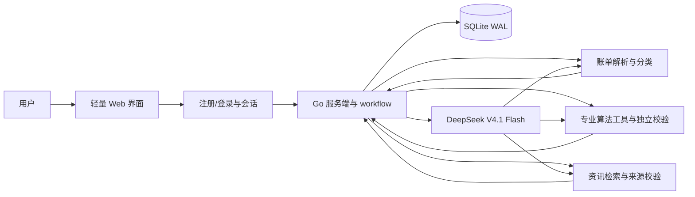

# 工行杯个人财务规划 WebApp — WORKPLAN

状态：方案与默认参数已获批准，实施中 · 2026-10-06

## 1. 产品定位与 MVP 边界

面向中国大陆、以人民币管理月度预算，希望先保障生活、再稳健积累资产的个人用户。演示目标是让**多名用户同时在线、各自登录**，并在各自的独立空间中完成「导入账单与问答 → 获得可解释的月度预算和资产配置方案 → 记录执行情况 → 查看月末反馈 → 对话调整方案」的闭环。

本计划将“预期年化大于 3%”作为长期财富增值部分的**规划目标**，不是产品收益承诺，也不把整体家庭资产、风险预备金或任意一个月的收益都宣称能达到该值。若用户不能承受亏损、现金流不足、存在高息债务或预备金不足，系统应明确提示目标当前不适用，先处理更优先的问题。

MVP 提供预算与资产类别层面的建议，不提供具体金融产品的买卖、代客交易、账户直连、自动扣款或收益保证。这一范围由产品目标决定；方案仍需显示风险、假设和计算依据。

## 2. 用户流程与页面

| 页面/步骤 | 用户可做的事 | 系统输出与关键状态 |
| --- | --- | --- |
| 注册/登录与欢迎页 | 创建个人账号、登录；登录后选择导入账单或载入专属体验样例 | 清楚展示流程、预计填写内容、退出登录与清空数据入口；不同用户互不可见 |
| 账单工作台 | 上传 CSV 并预览字段映射；或在可视化表单中逐笔/批量填写、编辑、删除、选择分类 | 两种入口进入同一账本；即时展示分类汇总、月份筛选、导入笔数、重复与异常提醒；不支持的格式给出模板 |
| 财务问答 | 填收入稳定性、固定开支、负债、现有储蓄、短中期目标、可承受亏损；可与交互 Agent 多轮补充 | 结构化画像草稿、缺失项和用户确认页 |
| 方案页 | 查看月度收支分配、预备金缺口、三类资金安排，调整约束后重新生成 | 每笔预算的计算依据、可用余额、风险解释、来源与更新时间；展示方案版本 |
| 解释对话 | 询问“为什么这样分配”“如果收入下降怎么办”，提出调整意见 | Agent 解释已有计算与来源；变更须重新经过规则校验并形成新版本 |
| 本月执行 | 在可视化账本补录、编辑交易或再导入当月 CSV | 类别预算剩余额、超支提醒、计划储蓄与实际储蓄 |
| 月末复盘 | 对比计划与实际，确认下月调整 | 收支变化、净结余、预备金进度、目标偏差、调整建议；区分“已存下的钱”和“投资收益” |

演示路径：每个新账号可一键生成**仅属于该账号**、明确标注为“模拟数据”的账单与问答样例，能在无真实账单的情况下完成全流程；用户也可直接上传 CSV 或在页面手填。演示时准备两个独立账号并发操作，验证数据、对话和方案不会串号。用户可清空自己的样例后开始真实体验，样例不混入其他账号的数据。

## 3. 数据来源与处理

### 3.1 账单

MVP 提供**同等地位的两种账单录入方式**：①用户主动上传 CSV；②直接在可视化账本填写收支。可视化表单支持日期、收支方向、金额、类别、描述和备注，支持逐笔新增、行内修改/删除、按月份和类别筛选，并即时更新汇总图。不做银行或支付平台账户抓取。

CSV 提供通用模板和字段映射器，兼容常见导出列名，但以实际用户文件预览确认的列映射为准。导入前展示解析结果；服务端做类型校验、金额符号统一、去重、异常值标记。无法识别的记录进入“待确认”，不悄悄计入预算。CSV 与手填记录进入同一标准化交易模型，均可在账本页面修正分类；导入批次和记录绑定当前账号，重复检测限定在该账号内。

### 3.2 新闻与宏观信息

服务端用 [GDELT DOC 2.0 API](https://blog.gdeltproject.org/gdelt-doc-2-0-api-debuts/)检索近期经济与金融新闻标题、日期和原文链接；对与方案相关的宏观事实，优先展示[中国人民银行](https://www.pbc.gov.cn/)及[国家统计局数据发布](https://www.stats.gov.cn/sj/zxfb/)等原始出处。新闻只提供环境背景和风险提示，不直接决定个人风险等级或生成“必涨”判断。每条进入方案的材料保存来源、发布时间、抓取时间、关联结论；过期、无出处或取回失败时隐藏相应论据并标明“外部资讯暂不可用”。不依赖未经授权的付费行情接口。

### 3.3 DeepSeek

官方文档确认 V4.1 Flash 的 API 模型 ID 为 `deepseek-flash`，接口基址为 `https://api.deepseek.com`，支持结构化输出和工具调用：[接入文档](https://api-docs.deepseek.com/guides/codex)、[Responses API](https://api-docs.deepseek.com/api/create-response/)。仓库当前的密钥位于 `.env/deepseek_api.key`（这是目录下的密钥文件，不是普通 dotenv 格式的 `.env` 文件）。实现时由服务端读取该文件，或读取部署环境变量 `DEEPSEEK_API_KEY`；不向浏览器下发。首个开发步骤要将 `.env/`、`.env.local` 加入 `.gitignore`，并检查 Git 跟踪状态。模型请求使用汇总数据和必要字段，减少令牌开销。

## 4. 方案生成规则

**方案由 Agent 在受控 workflow 中生成**：Agent 决定是否追问、调用哪些专业计算工具、如何解释权衡与给出候选方案；工具返回可复算的数字、约束和出处。Agent 不能凭文字绕过现金流、风险和总额校验。这样既保留个性化推理，也让每个金额都有明确的算法来源。

### 4.1 检索到的专业方法及采用方式

| 方法 | 可复现计算/判断 | 在本产品中的用法与边界 |
| --- | --- | --- |
| [CFPB 的 50/30/20 预算规则](https://www.consumerfinance.gov/consumer-tools/educator-tools/youth-financial-education/teach/activities/analyzing-budgets/) | 以**税后月收入**为分母，必要支出、可选支出、储蓄目标的参考比例为 50%、30%、20% | 作为对照基线，而非强制比例；实际必要支出和债务还款优先，超出基线时展示偏差并要求 Agent 解释 |
| [FINRA 的应急资金方法](https://syndication.finra.org/content/start-your-financial-road-trip-emergency-fund) | 以每月实际生活开支为基数，目标为约 3–6 个月；收入不稳定或可用信贷不足时倾向区间上端 | 计算 `目标预备金 = 必要月支出 × 目标月数`、`缺口 = max(0, 目标预备金 − 当前可动用预备金)`；收入稳定且家庭负担轻取 3 个月，否则取 6 个月 |
| [FINRA 的风险能力、期限与流动性框架](https://www.finra.org/investors/insights/know-your-risk-tolerance) | 分别评估承受损失的**能力**、主观**意愿**、资金使用**期限**和流动性需求 | 三档风险上限取各维度中更保守的结果；无风险承受意愿或近期必须使用的资金，不进入增长配置。问卷及阈值会版本化并展示依据 |
| [SEC 的资产配置与再平衡原则](https://www.investor.gov/additional-resources/general-resources/publications-research/info-sheets/beginners-guide-asset) | 资产类别随目标期限和风险承受能力变化；持续投入可优先补足低配类别 | 仅给现金/低波动/增长类的候选比例与情景；月末复盘先比较目标与实际偏差，再建议调整新增投入，不按新闻涨跌追逐热点 |

曾核对[Markowitz 均值—方差组合模型原论文](https://onlinelibrary.wiley.com/doi/abs/10.1111/j.1540-6261.1952.tb01525.x)。它需要可信的资产预期收益、波动率和协方差估计；本 MVP 不提供具体可投资产品和可靠行情，故不把它直接用于计算“最优组合”，以免产生虚假的精确度。未来若取得可验证行情与产品数据，可把它作为独立实验模块评估。

### 4.2 可复算的 workflow 算法

1. **数据核验**：Agent 调用 `summarize_cashflow`，将 CSV/手填交易统一分类；以用户确认的税后月收入和账单汇总为输入。若少于一个完整月份或金额冲突，追问并显示数据可信度，不能直接给精确方案。
2. **预算基线**：计算 `月净结余 = 税后月收入 − 必要支出 − 债务最低还款 − 可选支出`，并列出 50/30/20 参考值。Agent 调用 `allocate_budget` 以真实必要支出和债务为硬约束，先保障生活，再在剩余额度内安排娱乐、教育和储蓄。各项金额非负，合计不超过月收入；必要支出超过 50% 时不强行压到 50%。
3. **预备金**：调用 `calculate_reserve`，得到目标、现有余额、缺口及建议月度补足额。负结余时不安排新增投资；有高息债务时把债务成本与可投资收益假设并列说明，优先提醒偿还高成本债务，不由 Agent 宣称投资一定能覆盖利息。
4. **风险约束**：Agent 追问期限、流动性、收入稳定性、家庭责任、负债、可接受最大亏损和投资经验；`assess_risk` 分开返回风险能力、风险意愿、期限约束及最终上限。关键答案矛盾则继续追问；缺失时按保守档且显式标注。增长类占可投资余额的上限：低风险 0%、中风险 20%、高风险 40%。
5. **候选方案**：调用 `propose_allocation`，只对可投资余额在保守储蓄、稳健配置、增长配置三个资产类别中提出候选。Agent 可以比较多个满足约束的候选并说明取舍，不能超过工具给出的风险上限，不能把短期必须使用的钱放进高波动类别。
6. **外部依据与目标检验**：Agent 仅在需要解释宏观背景时调用 `find_sources`；工具返回可点击出处、日期和摘要。`check_goal` 对“大于 3%”进行假设情景演算，同时展示费用、亏损情景与未达标可能性；没有足够市场依据时仅显示为用户目标，不声称可预测的预期收益。新闻不直接修改风险分层或收益参数。
7. **独立复核与确认**：服务端用 `validate_plan` 重算所有金额、检查风险档、来源和数据完整度。通过后 Agent 生成带公式与依据的方案解释，用户确认才保存新版本。调整请求重新运行受影响的步骤，保留前后差异与参数版本。月末复盘从实际交易重算，不让模型编造“攒了多少钱”。

每一步记录输入摘要、工具版本、输出和是否人工确认，便于在演示中展示“方案如何产生”。工具只在服务器执行；Agent 不能写数据库或直接读取其他用户资料。

## 5. Agent 与后端工作流

- **交互 Agent（自建状态机）**：按“收集 → 追问缺项 → 回显画像 → 用户确认”运行；模型返回结构化字段、置信度与下一问，服务端用 schema 校验。达到最低完整度且用户确认后才进入方案。
- **方案 Agent（受控 workflow）**：沿第 4 节的流程调用账单统计、预算、预备金、风险评估、候选配置和来源工具，比较候选后生成结构化方案。服务端独立重算并校验总额、预算非负、风险上限、来源有效性，再展示。每次生成限制步骤、工具调用、令牌、超时与并发，避免循环并适应 1 核 VPS。
- **问答与反馈**：优先从当前用户的方案版本、账单汇总和来源回答。Agent 的调整提议以显式参数提交给规则引擎，用户确认后保存新方案。月末反馈使用实际交易重新计算，不由模型编造“攒了多少钱”。每次工具调用都携带服务端已验证的用户上下文，不能由模型选择或改写用户 ID。
- **模型故障降级**：若 API 不可用，仍可完成 CSV 导入、规则计算和复盘；界面显示“智能解释暂不可用”，保留操作结果。

## 6. 技术架构与数据模型

目标部署环境固定为**日本 VPS：1 vCPU / 1 GiB RAM / 5 GiB 存储**。建议用 **Go 单进程服务**承载 HTTP、页面模板、CSV 解析、workflow、DeepSeek 调用和定时资讯缓存；静态 CSS/少量 JavaScript 与图表资源打包进可执行文件，页面采用服务端渲染并用少量渐进增强交互实现可视化账本。VPS 不运行 Node.js 构建器、Next.js 服务、PostgreSQL、Redis、向量数据库或本地大模型。开发/构建在本地或 CI 完成，仅把产物部署到 VPS。

数据存储改为 **SQLite WAL**，单机短事务和索引支持 MVP 的少量并发账号。SQLite 官方说明 WAL 可让读写并行，但仍只有一个写入者，因此对方案生成采用短事务、写入排队/忙等待与有限并发，避免持有数据库锁等待模型或新闻接口：[SQLite WAL 文档](https://www.sqlite.org/wal.html)。选用已修复官方 WAL 缺陷的受维护 SQLite 版本，部署前验证驱动内核版本。HTTPS 可由轻量反向代理提供；整个服务按单机单实例设计，未来流量增长再迁移到独立数据库。

资源约束纳入实现和验收：上传 CSV 采用流式解析并限制大小与行数，原文件默认不落盘；模型和新闻请求设置超时、并发上限与用户级频率限制；公共新闻短期缓存，个人化结果不跨用户缓存。日志轮转、SQLite 检查点和离机备份控制 5 GiB 磁盘使用；备份使用 SQLite 一致性备份方式，不能直接复制正在写入的数据库文件。以双账号并发演示和资源监测检验 1 GiB 内存与 5 GiB 磁盘约束，不预先承诺未经压测的用户容量。账号和交易额度按压测结果设置，达到容量上限时拒绝新增上传并给出可理解的提示。

账号采用注册/登录和安全会话；具体实现可使用成熟的认证库、服务端密码哈希与受保护的会话 Cookie。注册、登录设置基本的请求频率限制，退出登录使会话失效。不在客户端保存密码或 DeepSeek 密钥。每个请求先验证会话，再根据当前会话确定用户身份；不能信任浏览器传来的 `userId`。

主要实体：`User`（账号）、`Session`（登录会话）、`Profile`（画像与确认状态）、`Transaction`（标准化交易与导入批次，注明 CSV/手填来源）、`PlanVersion`（参数、算法版本、金额、解释和来源）、`WorkflowRun`（工具调用与校验摘要）、`MonthlyReview`（计划与实际快照）、`SourceRecord`（新闻/宏观出处与时间）、`Conversation`（必要的对话上下文）。所有个人实体有明确的 `userId` 归属；读取、修改、删除时均按当前会话的 `userId` 过滤并复核归属。公共新闻可共享缓存，但个人化摘要与对话不得共用缓存键。金额以“分”为整数存储，日期和时区显式处理；账单原文件默认解析后删除，仅保留用户确认的标准化交易。用户可删除自己的全部账单、画像、方案和对话数据。

API 以业务动作划分：注册/登录/退出、上传/预览与确认账单、可视化交易增删改、画像问答与确认、生成/调整方案、当月交易补录、生成复盘、来源检索、清空我的数据。每个写操作有输入校验和错误码；上传限制文件类型与大小，外部资讯抓取有超时和缓存。方案版本更新采用事务与版本号检查，避免同一账号多标签页同时修改造成覆盖。服务端诊断日志不写入密钥或原始账单。

## 7. 页面表现与解释方式

视觉重点是让评委在短时间内看懂三件事：**钱从哪里来、分到哪里去、执行后剩多少**。登录后首页用步骤导航，并清晰标明当前账号和样例/真实数据状态；账本页提供可视化表格与新增/编辑表单，支持不上传文件也能完整填写账单；方案页上半部分给月度现金流总览和分配图，下半部分给“为什么这样分配”的可展开说明及 workflow 步骤记录。预备金与增长配置分别标明用途、可动用时间和风险，避免把二者混为“收益”。月末页用计划/实际并排图、净结余数字和具体偏差事件；所有新闻引用可点击原文并显示日期。手机和桌面宽度均可使用，表单支持逐步保存与返回修改。

关键空态/异常态：账单不足一个月、没有收入记录、收支为负、重复交易、风险答案冲突、资讯过期、模型超时、没有投资空间。每一种状态都给用户下一步操作，不生成看似精确但无依据的比例。

## 8. 开发顺序与验收

| 阶段 | 交付物 | 验收标准 |
| --- | --- | --- |
| 0. 轻量基础、账号与密钥保护 | Go 单进程、SQLite WAL、注册/登录、会话、环境配置、Git 忽略规则、每账号模拟数据 | 两个账号可同时登录；密钥不进入客户端包和版本库；VPS 上不运行数据库/Node 独立服务 |
| 1. 双账单入口与画像 | CSV 映射/校验、可视化账本增删改与分类、问答状态机、画像确认 | 不上传文件也能完整录入；CSV 与手填数据进入同一账本；两账号记录隔离 |
| 2. 专业算法与方案 workflow | 预算基线、预备金、风险约束、候选配置、结构化方案及步骤解释 | 算法独立可复算；负结余/预备金不足/低风险场景有正确分支；Agent 输出不得越过校验 |
| 3. 资讯与 Agent | GDELT 检索、来源卡片、DeepSeek 交互与方案解释 | 有出处才引用；无网络或模型失败时核心计算仍可运行 |
| 4. 复盘与多用户演示 | 月内补录、月末对比、清空数据、双账号演示脚本 | 两名用户同时从空档案到复盘完整走通，数据与对话隔离；CSV 上传和页面手填均可用 |

必要验证：预算、预备金和风险算法的固定输入/输出样例及边界测试（零收入、负结余、债务高、低风险、短期限）；CSV 与可视化手填的金额、日期、重复及编辑测试；模型输出结构和工具限制测试；双账号完整演示流程；移动端布局和数据删除检查。针对每个个人数据 API 做跨账号访问测试：用户 A 不得读取、修改、删除用户 B 的账单、画像、方案、复盘或对话；还要验证登录失效、同时更新方案的版本冲突，以及样例数据只进入本账号。在目标规格 VPS 上记录并发演示时的峰值内存、CPU、磁盘用量与响应情况，完成后记录启动命令、备份/恢复步骤和已知容量限制。

## 9. 已批准的产品决定与剩余参数

依据本轮审批，以下方向已确定：

1. MVP 面向**中国大陆个人用户、人民币月度预算**；允许每账号载入模拟账单。
2. 建议停留在**资产类别与预算分配**层面，不展示具体产品名称或购买入口。
3. 已确认默认参数：收入稳定且家庭负担轻的预备金目标为 **3 个月必要开支**，收入不稳或有家庭负担为 **6 个月**；可投资余额的增长类上限按低/中/高风险分别为 **0%/20%/40%**。
4. MVP 支持**多人同时在线、各自登录和完整数据隔离**。
5. 部署目标为**1 vCPU、1 GiB RAM、5 GiB 存储的日本 VPS**，技术栈和验收围绕该规格设计。
6. 账单入口同时支持 **CSV 上传和可视化页面手填/编辑**。
7. 方案由 **Agent workflow** 生成，专业算法工具提供可复算约束与计算，最终结果经独立校验。
8. 产品运行在**赛方提供的可控环境**，真实用户可上传账单或手填交易；本阶段不安排隐私合规与审核流程。

已开始按本计划实施。
