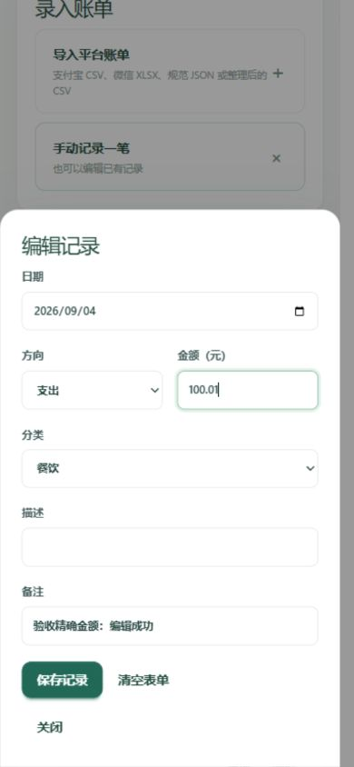
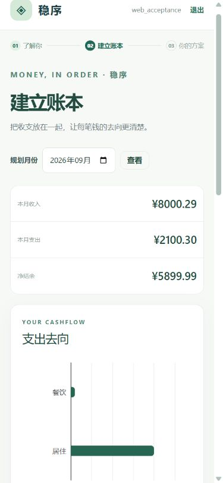
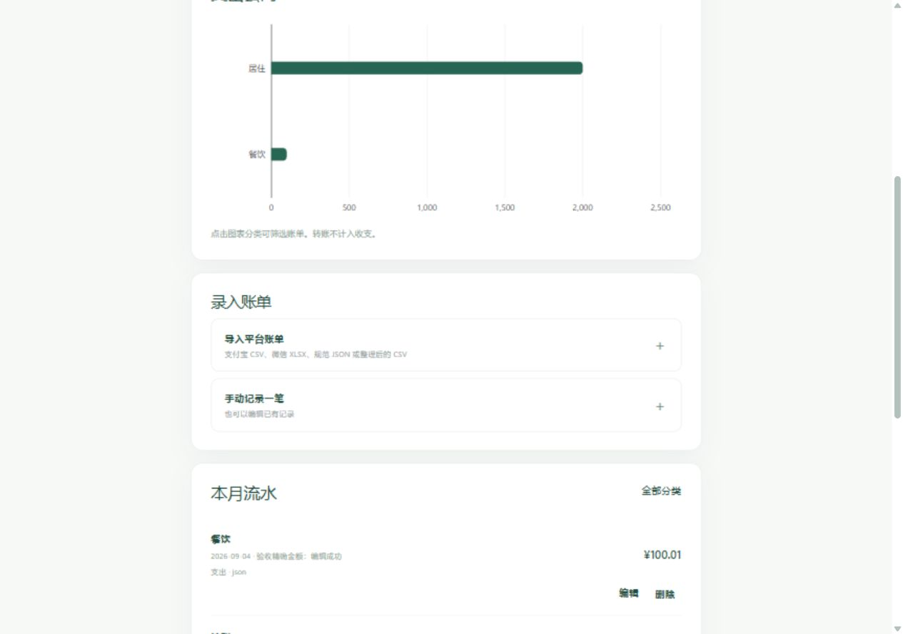

# Python / Go / 手机 Web 整合验收

日期：2026-10-08。环境：Windows、Go、Python 3.13、Codex Chromium 浏览器。隔离数据在 `.acceptance/go`、`.acceptance/python`；所有财务数字均为合成测试数据，旧数据未迁移、未删除。结论：本机功能和回归验收通过，真机与生产环境项目仍待验收，不记为全部通过。

## 自动测试与联调

| 项目 | 结果 | 证据与边界 |
|---|---|---|
| Python 全套 | 510 passed，35.56 秒 | pytest，包含原 Agent、平台清洗、规则、检查点与新增 Web 服务测试 |
| Go | test / vet 通过 | 包含局部 HTML、跨语言 null/0、受信任用户标识、转账、轮询与历史恢复、账本删除 |
| 前端 | 构建与 JS 语法检查通过 | 本地 Tailwind/daisyUI、HTMX、ECharts；CSS 优化有 `@property --radialprogress` 提示，未阻断构建 |
| 完整 HTTP 联调 | 通过，最终版本再次通过 | `agent/scripts/web_acceptance.py`：真实 Go → Python 服务；两个合成账号；离线规则流程 |
| 脚本化假模型 | Python 测试通过 | 各 Agent 的工具、反馈解析、确认分支与复盘经验回流；与上述 HTTP 离线测试分别验证 |
| 真实模型 | 合成画像回合通过 | degraded=false，income_cents=800000，有回复；没有把真实模型全业务循环标为通过 |
| 一键运行 | 实际启动与停止通过 | `scripts/start-web.ps1 -Offline -Listen 127.0.0.1:8082`；Go /ready 和 Python readiness 正常，关闭脚本后两个端口不再监听 |
| 完整备份 / 恢复 | 通过 | 停止两服务；备份 21 个文件 SHA256 全部一致；副本恢复可读取 Go 4 笔账本、Python 画像、方案版本、已确认复盘与经验包 |

完整 HTTP 测试路径：注册两账号 → 手填画像并确认 → 收入 8000.29、支出 2000.29、转账 100.01 → 本月核对补充结余去向并确认 → 方案生成/修改/确认 → 答疑 → 复盘生成/确认 → 方案提示输入已更新 → 第二账号无法读取第一账号资料。每轮操作经过 Go 会话与 CSRF，浏览器不拼装 PlanInputs。

## 浏览器实际操作

| 项目 | 结果 |
|---|---|
| 注册、画像发送、手填画像与显式确认 | 通过（前一轮浏览器验收，本轮完整 HTTP 再验证） |
| 本月核对、方案修改与确认、答疑、复盘确认 | 通过，等待片段可见，普通操作不整页刷新 |
| 文件选择、清洗预览、确认导入、取消预览 | 通过：规范 JSON 两笔合成流水；平台 CSV/XLSX 在 Python 清洗测试中验证 |
| 精确金额、转账排除、重复确认导入 | 通过：预览 0.29 元转账与 100.01 元支出；确认后收入 8000.29、支出 2100.30、结余 5899.99；重复确认仍为 4 笔 |
| 编辑 / 分类筛选 | 通过：手机底部弹层保存备注；点击图表居住分类仅显示对应流水 |
| 返回 / 刷新 / 直接访问 | 通过：返回后保留页头、正确标题、一个 main 和对应图表；财务历史不在本地保存完整 HTML |
| Python 停止与重新连接 | 通过：内联可重试错误，已保存账本和汇总保留；重新连接恢复；图表已改为从 Go 已保存账本独立生成 |
| 手机宽度 360 / 390 / 430 | 通过：可用宽度分别为 345 / 375 / 415（系统滚动条占 15px）；scrollWidth 未超过 clientWidth；长方案可滚动、空配置显示暂无数据 |
| 桌面 1280 | 通过：可用宽度 1265，主内容居中 780px，未横向溢出 |
| 最终文件预览取消回归 | 通过：浏览器错误日志为空，取消后 mainCount=1、chartCount=1 |

## 本轮发现并修复

- 轮询继承页面导航与片段选择配置，导致历史写入 `/jobs/...`；轮询显式关闭 URL push 并取消页面级 select。
- 历史缓存未命中时只返回片段，返回后丢页头；恢复请求返回完整文档，用主内容历史区域，恢复后按当前标题和月份初始化图表。
- 多个 action 按钮形成集合，焦点恢复调用失败；只对具备 focus 方法的字段执行恢复。
- 浏览器禁止恢复文件输入的非空 value；文件字段不进入文本草稿恢复，失败时当前文件 DOM 保留，切页后重新选择。
- 取消导入预览继承表单局部替换目标，造成重复主内容；取消链接显式替换主内容。
- 旧月度确认卡片和方案草稿在事实更新后仍显示确认；增加草稿版本有效性检查，更新后重新读取事实和生成方案。
- 无密钥时修改解析失败阻断有效规则方案；保存原方案并明确告知修改未应用，依然要求用户显式确认。
- 确认检查点已落定、展示投影尚未写入的中断窗口；重试核对检查点并补齐投影，版本去重。新增故障窗口测试通过。
- 手机编辑弹层背景与关闭状态不明确；加入明确背景、可滚动高度与关闭隐藏规则。
- 复盘对比图使用英文字段名；改为中文标签。

## 未计为通过的项目

1. 实体 Android / iPhone 的软键盘遮挡、输入法、系统文件选择器、Safari 行为。
2. 开启系统“减少动态效果”后的实际浏览器操作；CSS 与图表代码已有对应分支，本次没有把代码检查算作实际环境验收。
3. 真实模型下完整五类 Agent 的全业务联调，以及外部金融来源的生产可达性；本次真实调用只验证画像回合。
4. 大规模账本和持续切页的内存剖析、目标 VPS 负载/资源/备份权限验收，以及任意强杀时点的故障注入。已有自动测试覆盖并发、重复提交、待确认恢复、规则降级与局部故障窗口，不能代替这些环境测试。
5. 远程部署：按任务约定未执行。

## 复跑

在隔离数据目录启动离线 Go 和 Python，再运行：

```powershell
./agent/.venv/Scripts/python.exe agent/scripts/web_acceptance.py
go test ./...
go vet ./...
cd agent
./.venv/Scripts/python.exe -m pytest -q
```

HTTP 脚本会创建两个合成账号，只允许本机地址。构建与部署、双服务备份操作见 [WEB_OPERATIONS.md](WEB_OPERATIONS.md)。






