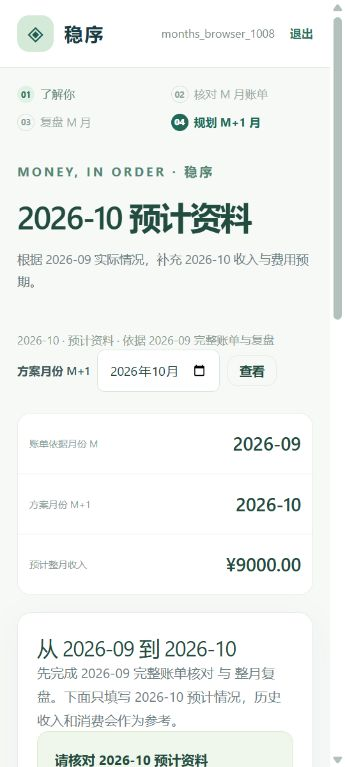
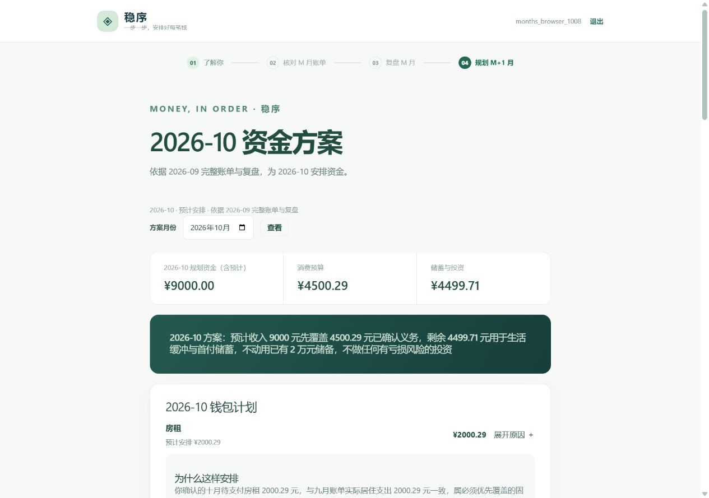
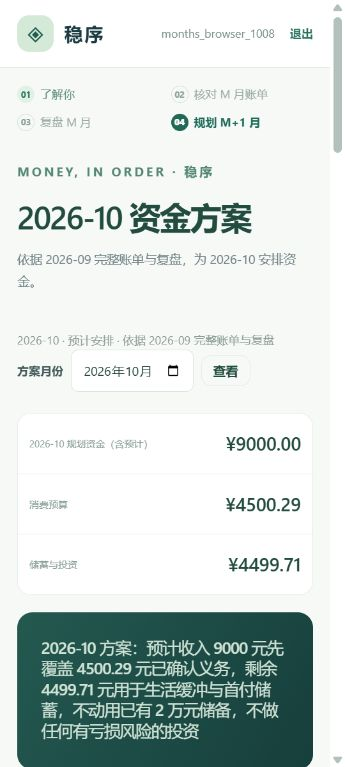

# M 月账单 → M+1 月方案验收

2026-10-08，使用真实 Codex 内置浏览器、本地 Go 与 Python 服务、现有真实模型配置及独立合成测试账号。测试资料与缓存位于独立验收目录，不使用真实用户账单。

## 结果

| 检查 | 结果 |
|---|---|
| 导入 2026-09 完整账单，核对收入、支出、转账 | 通过：收入 8000.29 元，支出 5000.29 元，结余 3000.00 元；转账不计收支 |
| 确认九月整月资料，生成并确认整月复盘 | 通过；没有原预算、缺少八月记录时不虚构比较 |
| 从九月复盘进入十月预计资料，草稿与显式确认 | 通过：预计收入 9000 元，房租 2000.29 元、餐饮 1500 元、探亲交通 1000 元 |
| 预计资料与实际账本分开 | 通过：十月实际账本仍为零笔，未把九月收入与支出复制过去 |
| 生成、独立校验并确认十月方案 | 通过：消费 4500.29 元，缓冲与储蓄 4499.71 元，合计 9000 元；不动用已有 20000 元储备 |
| 刷新后保留已确认方案、展开钱包依据 | 通过；房租依据明确引用九月实际与十月待支付义务 |
| 离开、返回、重新登录恢复任务 | 通过 |
| 切换账号 | 通过：新账号进入自己的未建画像状态 |
| 手机与桌面布局 | 通过；360 px 手机视口文档宽度 345 px、滚动宽度 345 px，无横向溢出 |
| 当月执行调整入口 | 通过：进入 2026-10 实际核对，要求填写到账收入；没有复制九月实际或十月预计收入作为已到账 |

已确认方案保存的生成依据为 `period=2026-10`、`source_period=2026-09`、`planning_mode=next_month`。预计收入未到账时页面明确提示到账后核对执行。

此次真实浏览器覆盖新月份主流程与当月调整入口，没有在浏览器执行完整的当月重新规划、所有平台账单格式或生产部署。相邻月份、资料失效、0 收入及独立调整会话等分支由自动回归覆盖。

## 回归

- Python：536 项通过（最终运行 34.43 秒）。
- Go：`go test -count=1 ./...` 通过。
- `go vet ./...`、`git diff --check` 通过。
- 沙箱初次运行因临时目录及回环连接限制失败；使用工作区独立临时目录和允许回环连接的执行环境后通过。

真实验收发现并修复了模型字符串数组契约不明确、缓冲总目标含义不明确、长会话裁剪产生孤立工具消息，以及旧模型段落字段导致钱包方案解析失败的问题。

## 截图

